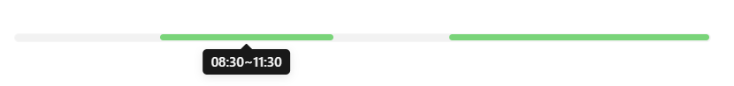

## 效果展示



## 相关文件

    - [/Dataview/Day-Line/view.css](./Dataview/Day-Line/view.css)
    - [/Dataview/Day-Line/view.js](./Dataview/Day-Line/view.js)

## 使用方法

首先请阅读：[Dataview 自定义视图的使用方法](../Usages/Dataview-Custom-View.md)。

基本调用格式如下：

```dataviewjs
await dv.view('/Dataview/Day-Line', {time: '08:30~11:30 13:30~18:00'})
```

### `time` 参数中

-   时间格式为 `HH:mm`，即两位 24 小时制的小时，和两位分钟，分号为英文分号
-   两个时间段之间用空格分隔
-   每段时间（一个开始时间点，一个结束时间点），用英文半角 `~` 进行连接
-   时间条默认全长为：06:00~18:00
-   如果第一个时间段是一个单独的时间点，则被认为是设定时间条的起点
-   如果最后一个时间段是一个单独的时间点，则被认为是设定时间条的终点
-   其他时间段如果只给出了一个时间点，则以前一个时间段的终点作为起点

### `Style` 参数中

-   给出一个数组，其中包含 0~11 的任意数字
-   会循环使用对应的样式（颜色）

例如：

```dataviewjs
await dv.view(
	'/Dataview/Day-Line',
	{
		time: '08:30~11:30 13:30~18:00',
		style: [6, 7]
	})
```

这里使用换行和缩进让代码变得更容易阅读。

### `nextDay` 参数

如果要表示的时间段是从第一天到第二天的，比如记录睡眠，把这个参数设置为 `true`，或者 `1`。

### 完整参数使用展示：

```dataviewjs
await dv.view(
	'/Dataview/Day-Line',
	{
		time: '20:00 21:30~06:00 08:00',
		style: [6, 7],
		nextDay: true
	})
```
