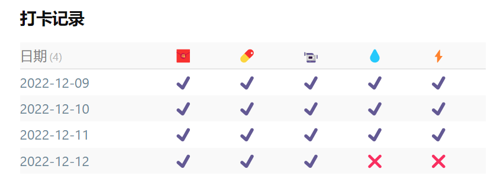

# 习惯打卡

## 效果展示



## 相关文件

- [/Dataview/Habits/view.css](../../Dataview/Habits/view.css)
- [/Dataview/Habits/view.js](../../Dataview/Habits/view.js)

## 使用方法

首先请阅读：[Dataview 自定义视图的使用方法](../Usages/Dataview-Custom-View.md)。

基本调用格式如下：

```dataviewjs
await dv.view('/Dataview/Habits', {dir: 'Notes/Life'})
```

### `dir` 参数

日记文件的路径。注意：**目前仅支持 YYYY-MM-DD 格式文件名的日记**。

可以看到，路径前后没有 `/`。默认为根目录，即在所有笔记中查找符合上述文件名格式的笔记。

### `mode` 参数

输出格式，类型为字符串，注意要有引号：

- `'today'` （默认），只输出当天的打卡信息
- `'month'` 输出当月打卡列表
- `'year'` 输出全年打卡列表
- `'all'` 输出全部符合条件笔记的打卡列表

这里有三个辅助参数，用来输出特定年月日的打卡列表。但不推荐。因为既然过去的日期打卡不太容易发生变化，那么一些汇总页（比如某一年某一月的月总结）中就没必要一直使用动态查询，用这个脚本生成表格然后复制过去好了。

#### `year` 参数

指定查询的年份。（仅在 `'year'`、`'month'`、`'today'` 模式下有效）

#### `month` 参数

指定查询的月份。（仅在 `'month'`、`'today'` 模式下有效）

#### `day` 参数

指定查询的日期。（仅在 `'today'` 模式下有效）

### `mark` 参数

默认为 `Mark`，用来说明这是一个打卡项目（会被查询汇总），具体书写格式如下：

```markdown
- Mark::🧧 00:23:00
- Mark::💊 08:32:09
- Mark::📹 09:06:43
- Mark::💧 
- Mark::⚡
```

前面的项目符号非必须，但这样可以让内容显示紧凑一些。

这里的表情符号对应着效果图中的每个项目名称，你也可以使用文字。空格后面是打卡时间，当然也可以写其他内容，如果不写，则被认为此项未完成。注意一定要用空格分隔项目名称和后面的打卡标记。

### `headers` 参数

类型为数组。

默认输出所有可用的打卡项目，但也可以通过此参数指定具体输出，比如：

```dataviewjs
await dv.view('/Dataview/Habits', {
  dir: 'Notes/Life',
  headers: ['💊', '💧'],
})
```

### `dateHeader` 参数

看效果图第一列是日期，这一列在非 `'today'` 模式下都会显示。你可以自定义它的标题。

如果自定义 `headers` 参数，则遵从 `headers` 的设定，不过你可以将其中的第一项设定为日期。

```dataviewjs
await dv.view('/Dataview/Habits', {
  dir: 'Notes/Life',
  mode: 'month',
  dateHeader: 'Date',
  headers: ['Date', '💊', '💧'],
})
```

### `show` 参数

显示方式：

- `'content'` 显示内容，如上面 `mark` 参数的示例，则会显示时间（打卡项后面的内容）
- `'yesorno'` （默认）简单地用标记来显示项目是否已完成，就如图片中演示的效果。

### `yesorno` 参数

设置 `'yesorno'` 模式下显示的标记，类型为数组：

```dataviewjs
await dv.view('/Dataview/Habits', {
  dir: 'Notes/Life',
  yesorno: ['✔️', '❌'],
})
```