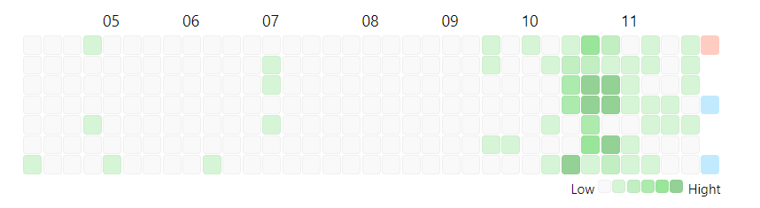

# 笔记热力图（Heatmap）

## 效果展示



## 相关文件

[/Dataview/Heatmap/view.js](../../Dataview/Heatmap/view.js)

## 使用方法

首先请阅读：[Dataview 自定义视图的使用方法](../Usages/Dataview-Custom-View.md)。

基本调用格式如下：

```dataviewjs
await dv.view('/Dataview/Heatmap')
```

我推荐大家这么使用。这样显示的是对应日期创建笔记的数量。

### `type` 参数

-   `cday` 笔记的创建日期（默认）
-   `mday` 笔记的更新日期
-   `created` 上边两个有坑，使用的文件的创建和更改时间，而这个是使用元数据中 `created` 字段的值
-   `updated` 这个是使用元数据中 `updated` 字段的值
-   `name` 笔记的文件名，如果你每天创建一篇日期格式名称的笔记，可以考虑这种方式
-   `task` 这个显示的是对应日期完成的任务数，前提是任务中标记了完成时间（就是任务中加入这样格式 `✅YYYY-MM-DD` 的标记，这个标记可以用 Tasks 插件自动添加）

使用演示：


```dataviewjs
await dv.view('/Dataview/Heatmap', {type: 'cday'})
```

### `heatData` 参数

直接传入自己生成的 heatmap 数据对象，只用此视图作为显示。使用示例：

```dataviewjs
await dv.view('/Dataview/Heatmap', {
  heatData: {
    '2022-10-28': 5,
    '2022-10-29': 1,
  }
})
```

### `levelGetter` 参数

方块的颜色有 0~5 共 6 个等级。默认数值大于等于 5 就都算作 level 5。假设给出的数据比较大，会看不出差别来。

你可以设定一个 `levelGetter` 函数，说明如何从数值计算出对应的等级，比如：

```davaviewjs
dv.view('Heatmap-dataview', {
  heatData: {
    '2022-10-28': 50,
    '2022-10-29': 13,
  },
  levelGetter: count => count>=50 ? 5 : Math.round(count/10)
})
```