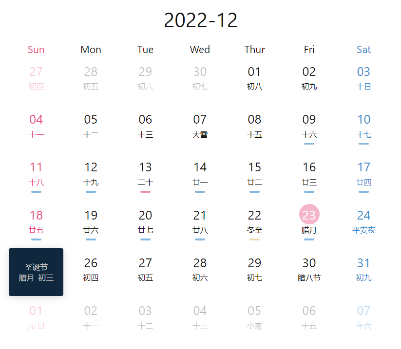
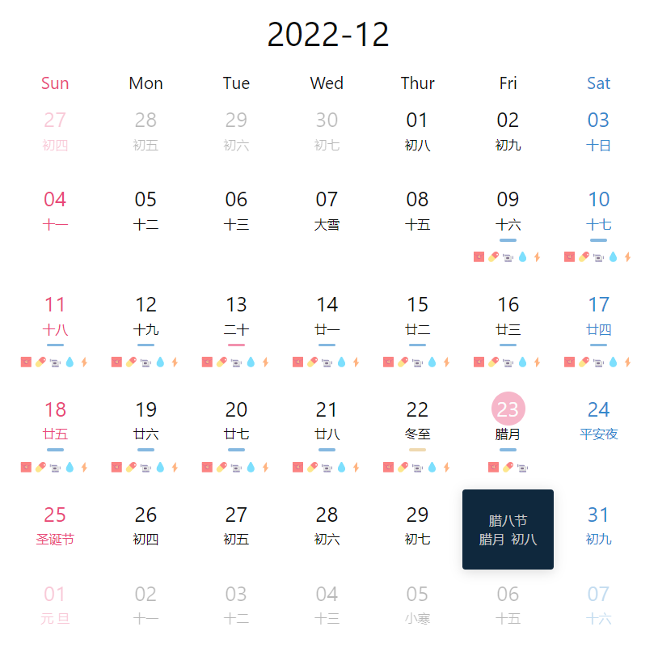

# 月历视图

## 效果展示



## 相关文件

- [/Dataview/Month-View/view.css](../../Dataview/Month-View-1/view.css)
- [/Dataview/Month-View/view.js](../../Dataview/Month-View-1/view.js)

# 细节说明

这是我子弹笔记系列的第二个工具，具体应用参见：[https://zji.me/9e2ddfe7-0da8-4751-8b64-da8601434092/](https://zji.me/9e2ddfe7-0da8-4751-8b64-da8601434092/)，文章密码在此获得：[https://afdian.net/item?plan_id=e808efe84f7a11ed86ec52540025c377](https://afdian.net/item?plan_id=e808efe84f7a11ed86ec52540025c377)。

红圈是今日（23）。

每日下横线代表有对应笔记，点击可跳转至笔记。黄色是有未完成任务（22），红色是有重要事件（13）。此功能可自定义。也可开启符号（文字）标记，效果如下：



## 使用方法

首先请阅读：[Dataview 自定义视图的使用方法](../Usages/Dataview-Custom-View.md)。

基本调用格式如下：

```dataviewjs
await dv.view("Templates/Dataview/Month-View", {dir: 'Notes/Life/Daily/{{YYYY}}/{{MM}}'})
```

### `dir` 参数

日记文件的路径。注意：**目前仅支持 YYYY-MM-DD 格式文件名的日记**。

可以看到，路径前后没有 `/`。默认为根目录，即在所有笔记中查找符合上述文件名格式的笔记。

路径中可以使用 `{{YYYY}}` 和 `{{MM}}` 两个变量。

### `year` 参数

指定查询的年份。默认今年。

### `month` 参数

指定查询的月份。默认当前月份。

### `weekNames` 参数

星期几的名称。默认：`['Sun', 'Mon', 'Tue', 'Wed', 'Thur', 'Fri', 'Sat']`

### `taskMarks` 参数

用来指定任务标记对应当日下划线颜色。任务标记为 `- [!] 任务` 格式中方括号内的内容。[Minimal](https://github.com/kepano/obsidian-minimal) 主题对此有良好的支持，也可以阅读：[0061 习惯打卡-DataView](https://zji.me/1ca8f877-9e00-4f67-a2df-b72e42177d23/)

默认值：

```js
[
  // 有未完成任务
  {
    color: 'rgba(229, 192, 123, .6)',
    marks: [' ', '<', '>']
  },
  // 有重要任务
  {
    color: 'rgba(233, 72, 120, .6)',
    marks: ['!', '*', 'e']
  },
]
```