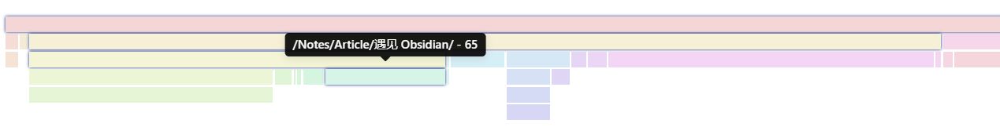

# 笔记分布视图

## 效果展示



## 相关文件

- [/Dataview/Notes-Count-View/view.css](../../Dataview/Notes-Count-View/view.css)
- [/Dataview/Notes-Count-View/view.js](../../Dataview/Notes-Count-View/view.js)

## 使用方法

首先请阅读：[Dataview 自定义视图的使用方法](../Usages/Dataview-Custom-View.md)。

基本调用格式如下：

```dataviewjs
await dv.view("Templates/Dataview/Notes-Count-View")
```

没参数，懒得写。

宽度限制，显示文字不好看，所以鼠标悬停查看说明。
