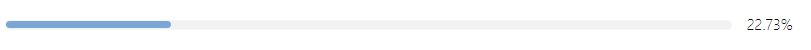

# 任务完成度

## 效果展示



## 相关文件

- [/Dataview/Task-Progress/view.css](../../Dataview/Task-Progress/view.css)
- [/Dataview/Task-Progress/view.js](../../Dataview/Task-Progress/view.js)

## 使用方法

首先请阅读：[Dataview 自定义视图的使用方法](../Usages/Dataview-Custom-View.md)。

基本调用格式如下：

```dataviewjs
await dv.view('/Dataview/Task-Progress')
```

如上使用的是默认参数：

```js
{
  page: dv.current(), // 当前页
  section: null,      // 无章节过滤
  defaultWeight: 1,   // 单个任务权重 1
  style: 5            // 色彩样式 5
}
```

参数均为可选，按需修改设定即可。

### `page` 参数

只能用 `dv.page('路径')` 来选择单个笔记，我觉得一般足够用了。

### `section` 参数

填写任务列表上面最近的那个标题，便只统计这个标题下的任务。留空则统计页面中的所有任务。

### `style` 参数

是 0~11 的整数，填写更大也没问题，反正总归只有 12 种颜色。颜色不是很好看，但基本上在深色模式和浅色模式下都还算看得过去。

### 带参数使用展示：

```dataviewjs
await dv.view('/Dataview/Task-Progress', {
      page: dv.page('Inbox/List/Working List'),
      section: 'Plan',
      style: 2
    })
```

## 任务权重

### `defaultWeight` 参数

说的是每个任务默认的权重。

那什么是权重呢？比如一个任务需要三个番茄时间，你设定它的权重为 3，另一个任务需要 5 个番茄时间，你设定为 5，还有一个设定为 2。虽然这里只有三个任务，但是你完成了第一个任务就是完成 30%（十分之三）。

还有一种情况：

- [ ] 大任务
  - [ ] 小任务一
  - [ ] 小任务二
  - [ ] 小任务三

这里是一个大任务分成了三个小任务，很容易理解如果完成了一个小任务，应该是完成了 33.33%，即三分之一，这时候我们完全没看那条大任务。所以在完成度计算的时候，这条大任务的权重应该为 0。

### 设定权重

在任务中的任意位置用这个格式添加：`【数字】`，比如：

- [ ] 这一条任务的权重是【3】，理解了吧
- [ ] 【5】如果这条任务中有两个这种格式【8】，第一个数字作为权重，所以是 5

## 只是进度条

只是想插入一个进度条，给它一个数字，它显示出来。

```dataviewjs
dv.view('/Dataview/Task-Progress', {
        percentage: 72
      })
```

`percentage` 参数，给一个 0~100 的数字就行了。只要有这个参数，且符合要求，就会忽略其他参数（`style` 参数依旧有效）。