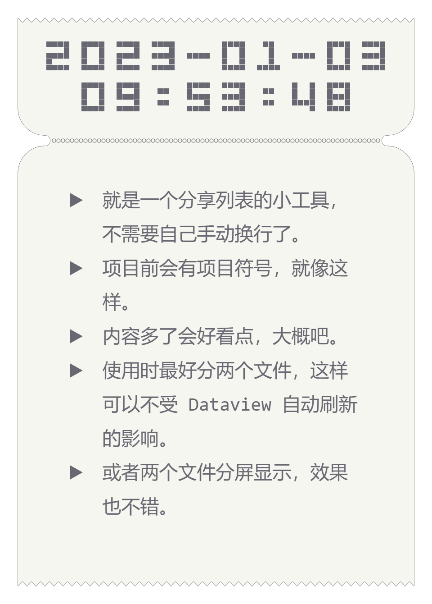

# 列表卡片（票据）

## 效果展示



## 相关文件

- [/Dataview/Ticket-Card/view.js](../../Dataview/Ticket-Card/view.js)

## 使用方法

首先请阅读：[Dataview 自定义视图的使用方法](../Usages/Dataview-Custom-View.md)。

基本调用格式如下：

```dataviewjs
await dv.view('/Dataview/Ticket-Card', {note: 'list.md'})
```

建议搭配 [Copy Image and URL context menu](https://github.com/NomarCub/obsidian-copy-url-in-preview) 插件使用。

### `note` 参数

指定列表笔记，如省略此参数，则为当前笔记。

### `fontSize` 参数

内容部分的文字大小，默认 `42`。

### `listOrder` 参数

列表项目符号，默认`▶`