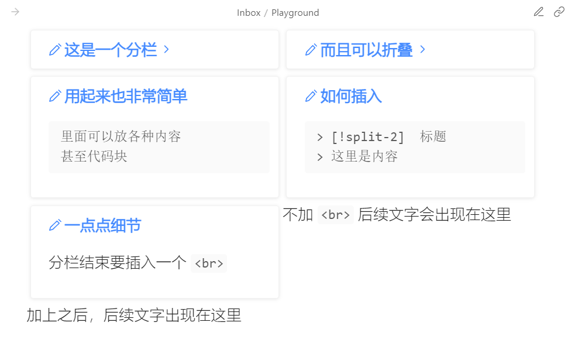

# 笔记内容分栏

## 效果展示



## 相关文件

[/snippets/Split-Page-Callout.css](../../snippets/Split-Page-Callout.css)

## 使用方法

首先请阅读：[CSS Snippets 的安装方法](../Usages/Install-CSS-Snippets.md)。

然后按如下格式使用：

```markdown
> [!split-2] 这是一个 1/2 宽度的分栏
> 这里是分栏的内容
```

如果 `[!split-3]` 就是 1/3 宽度，`[!split-4]` 就是 1/4 宽度。应该不需要再细分了，否则一块宽度太低，大概没法放内容了。如果你有需求，可以对上面 CSS 文件的内容进行照猫画虎。

可以连续书写多个块，它们可以并列显示，如果一行装不下会自动折行。不过同一行的块高度一致才会好看。

```markdown
> [!split-2] 这是一个 1/2 宽度的分栏
> 这里是分栏的内容

> [!split-2] 这是第二个块
> 两块之间要用空行分隔
```

## 清除浮动

这个可以不理解，照做就行，在使用分栏之后，单独一行写一个 `<br>` 再书写其他内容，这样就不会互相干扰。