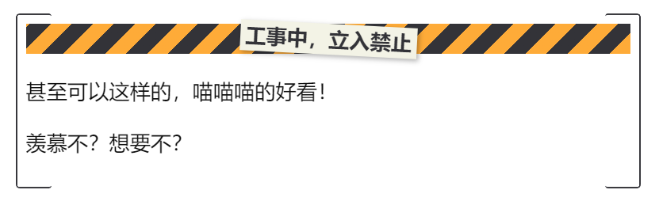

# 禁止通行分割条

## 效果展示


## 相关文件

[/snippets/Stop-Callout.css](../../snippets/Stop-Callout.css)

## 使用方法

首先请阅读：[Callout 样式的使用方法](../Usages/How-to-Use-Callout.md)。

然后按如下格式使用：

```markdown
> [!hr-stop] 工事中，立入禁止
```

标题文字随意修改，不过不要太长。

也可以加入更多内容，效果也不错：

