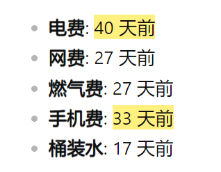

# 让加粗显著加粗

## 效果展示

## 问题解析

加粗不明显的问题是由字体引起的，有可能字体未提供相应的字重，导致无法显示出明显的加粗。

所以最好的方法是——换字体。

如果，无法接受上面方案，可以用此片段进行补救。不过效果一般。并且只能针对黑色字体（可以自己修改代码中的颜色）。原理是给加粗文字添加阴影，来变相实现加粗。

## 相关文件

[/snippets/Strong-Strong.css](../../snippets/Strong-Strong.css)

## 使用方法

首先请阅读：[CSS Snippets 的安装方法](../Usages/Install-CSS-Snippets.md)。

然后，然后就没然后了。