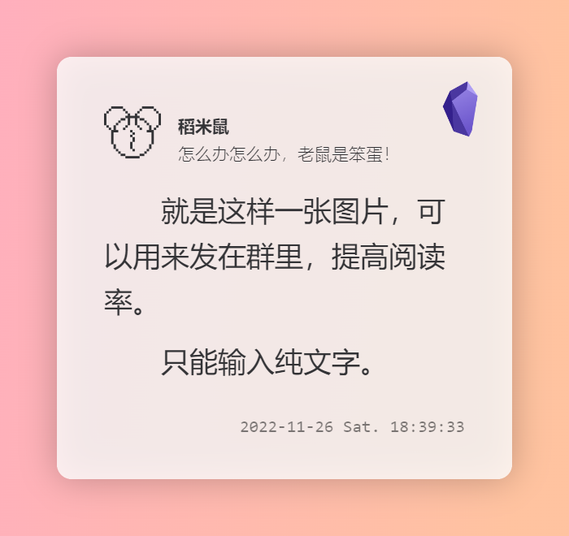

# 生成文字卡片

## 效果展示



## 相关文件

[/Templater-Scripts/Generate_Tweet_Card.js](../../Templater-Scripts/Generate_Tweet_Card.js)

## 使用方法

首先请阅读：[Templater 脚本的使用方法](../Usages/How-to-Use-Templater-Script.md)

然后按照如下格式调用：

在 Templater 的模板文件夹下新建文件，放入如下内容（无需代码块）：

```eta
<% tp.user.Generate_Tweet_Card(tp, {
  logo: `头像图片的 base64 地址`,
  name: '用来显示的昵称',
  userId: '用来显示的 @id 或者个性签名'
}) %>
```

### 基本参数

- **logo**：【字符串】头像图片，用 [https://c.runoob.com/front-end/59/](https://c.runoob.com/front-end/59/) 转换为 base64 字符串，填入即可。需要复杂效果，比如圆形什么的，自行通过修改这张图片获得
- **name**：【字符串】你的名字
- **userId**：【字符串】社交帐号，个性签名啥的都行，别太长，这里不会自动换行
### 基本使用

一般只需要上面三个参数。

然后**新建一篇笔记**插入此模板，会弹出输入框输入内容。Obsidian 的输入框并不好用，<kbd>Enter</kbd> 是确认（提交），<kbd>Shift</kbd>+<kbd>Enter</kbd> 才是换行，一不小心就搞错了。所以我疯狂推荐**现在笔记中书写好内容，复制，然后插入模板，把内容粘贴进输入框**。

确认之后就会提示保存图片了。

### 移动端

并不支持保存图片，所以得换种方式，添加一个参数。我自己是创建了一个专为移动端的模板，推荐你也这样用。

**isMobile**：【布尔型】默认为 `false`，这时候会尝试下载图片，而不插入笔记（省却了过去删除笔记的麻烦）。设置为 `true` 则不进行下载，直接向笔记中插入，配合 [Copy Image and URL context menu](https://github.com/NomarCub/obsidian-copy-url-in-preview) 在手机上预览模式下，点击图片，然后长按可以打开分享菜单（Android 下如此。没有苹果设备，不了解）。

```eta
<% tp.user.Generate_Tweet_Card(tp, {
  logo: `头像图片的 base64 地址`,
  name: '用来显示的昵称',
  userId: '用来显示的 @id 或者个性签名',
  isMobile: true
}) %>
```

**请不要使用这种方法将图片插入笔记**，虽然有很多教程教大家用 base64 的方式将图片直接写入笔记，但是真的会让笔记变卡，以及搜索变慢等。

### 高级参数（无用，无需阅读）

#### 尺寸参数

- **size**：`'S'`、`'M'`（默认）、`'L'` 三个预设尺寸可选，如果分享到移动端，或者社交媒体，推荐 `'S'`，群内公告推荐 `'M'`，大概如此。如果设置 `width` 参数，则会覆盖 `size` 设定
- **width**：【数字】图片宽度，默认 700，这是 Obsidian 笔记区的默认宽度。`size: 'S'` 对应 `480`，`size: 'L'` 对应 `960`

#### 边距设定

- **margin**：【数字】卡片的外边距，也就是白色卡片外面渐变色的宽度
- **marginLR**：【数字】是上面参数的左右方向分量，如果设定，在左右方向上覆盖上面设定
- **marginTB**：【数字】上下分量，其余同上
- **padding**：【数字】这是卡片区域的四边与内容之间的间距
- **paddingLR**：【数字】上面的左右分量
- **paddingTB**：【数字】上下分量

#### 卡片圆角

- **cardRadius**：【数字】圆角半径，不喜欢圆角就设置为 0

#### 文字

- **fontSize**：【数字】内容文字大小
- **smallFontSize**：【数字】用户名、ID、日期的文字大小
- **lineHeight**：【数字】行高，是字号的多少倍，默认 1.6
- **indent**：【数字】段首缩进宽度，默认是两倍字号，也就是缩进两个字，设置为 0 不缩进
- **fontFamily**：【字符串】字体

#### 颜色

- **bgColors**：【数组|字符串】背景颜色，使用数组可以设置渐变色
- **cardBgColor**：【字符串】卡片背景色
- **contetnColor**：【字符串】内容文字颜色
- **nameColor**：【字符串】用户名文字颜色
- **userIdColor**：【字符串】ID 文字颜色
- **timeColor**：【字符串】时间文字颜色

#### 右上角 Logo

- **appLogo**：【字符串】你可以设定为任何你喜欢的图标，设置方法和 `logo` 完全一致

#### 未联动

- **logoSize**：【数字】设定两个 logo 的尺寸，不过相关内容未与之联动，所以这里最好不要修改

